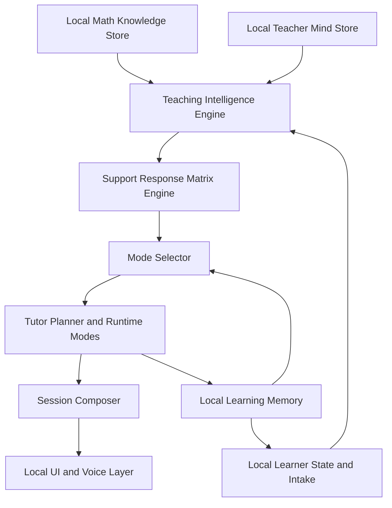

# MathTeach Architektur V2

## Aktive Richtung

`MathTeach V2` ist als `geschlossenes lokales Tutorsystem` gedacht.

Das bedeutet:

- kein Cloud-Zwang
- keine externe Laufzeit als Grundbedingung
- lokaler Mathematik-Korpus
- lokaler Teacher Mind
- lokale Lernerdaten
- lokal erklaerbare Tutorentscheidungen

Lokale Modelle bleiben spaeter moeglich, sind aber nicht das tragende Zentrum der Architektur.

## Architekturkern

## Hauptbausteine

### 1. Local Math Knowledge Store

Enthaelt:

- Werke und Quellen
- Chronologie
- Cross-epoch network
- Begriffe, Herleitungen, Anwendungen, Misskonzepte

Diese Schicht liefert das fachliche Fundament.

### 2. Local Teacher Mind Store

Enthaelt:

- Psychological Foundations
- Pedagogical Foundations
- Universal Rounds
- Support-spezifische Regelwerke
- spaetere Mathematics Teaching Foundations

Diese Schicht liefert die Vermittlungsintelligenz.

### 3. Local Learner State and Intake

Enthaelt:

- selbstbeschriebene Lernbedarfe
- aktuelle Lernziele
- Vorwissen
- beobachtete Reibungspunkte
- lokale Verlaufshistorie

Wichtig:

- kein Diagnosesystem
- keine Cloud-Synchronisation als Voraussetzung
- nur lokale Speicherung

### 4. Support Response Matrix Engine

Dies ist die neue Schluesselschicht.

Sie uebersetzt:

- `support signal profile`

in:

- `response settings`

Beispiele:

- Tempo
- Schrittgroesse
- Symbolik
- Textlast
- Visualisierung
- Fehlerbehandlung
- Checkrhythmus
- externe Strukturhilfen

### 5. Mode Selector

Diese Schicht trennt jetzt explizit:

- `requested_mode`
- `selected_mode`

Sie verarbeitet:

- aktive Supports
- Konfliktpaare
- Triads
- Priority Ladders

und entscheidet danach, welcher stabile Lehrmodus fuer die aktuelle Sitzung
getragen werden soll.

Wichtig:

- wenige stabile Modi
- explizite `constraints`
- keine opaque Mittelwertlogik

### 6. Tutor Planner and Runtime Modes

Die Runtime verbindet:

- Inhalt
- Profil
- Response Settings
- ausgewaehlten Lernmodus

Aktuelle Moduslinie:

- `worked_example_tutoring`
- `origin_story_explanation`
- `origin_then_example`
- `guided_concept_explanation`
- `formal_compact_explanation`

Spaeter erweitert um:

- `guided_practice_loop`
- `prerequisite_repair`
- `live mode adaptation`

### 7. Session Composer

Der Composer erstellt die konkrete Sitzung:

- Erklaerung
- Beispiel
- Rueckfrage
- Zwischencheck
- naechsten Schritt

Diese Schicht muss:

- fachlich korrekt
- emotional sicher
- formatbewusst
- erklaerbar adaptiv

arbeiten.

### 8. Local UI and Voice Layer

Das System soll als:

- App
- Desktop-Loesung
- Tablet-System
- eigenes Geraet

nutzbar bleiben.

Die Plattform ist austauschbar. Die Kernlogik bleibt gleich.

## Betriebsprinzipien

### 1. Local-First

Das System muss ohne Netz funktionsfaehig bleiben.

### 2. Rule-Based First

Tutorentscheidungen sollen zuerst:

- explizit
- pruefbar
- dokumentierbar
- spaeter testbar

sein.

### 3. Optional Intelligence, Not Mandatory Cloud

Lokale Modelle oder spaetere modellgestuetzte Hilfen koennen ergaenzen.
Sie sind aber nicht die Grundvoraussetzung fuer:

- Unterricht
- Support-Anpassung
- Profilsensitivitaet

### 4. Safety Without Therapy

Das System ist:

- psychologisch informiert
- trauma-aware
- neurodiversitaetsbewusst

aber:

- kein Therapeut
- kein Diagnostiker
- kein medizinisches System

### 5. Explainable Adaptation

Jede relevante Tutorentscheidung soll spaeter auf eine lesbare Regel oder
einen erkennbaren Supportgrund zurueckfuehrbar sein.

## Aktuelle Schwerpunktverschiebung

Die erste Projektphase baute vor allem:

- Mathematik-Korpus
- Teacher Mind Foundations
- Runtime-Grundmodi

Die naechste Phase baut jetzt:

- `Support Response Matrix`
- `response_engine`
- `mode_selector`
- Planner-Integration
- spaetere `live mode adaptation`

Damit verschiebt sich die Architektur von:

- `Wissen sammeln`

zu:

- `Wissen adaptiv ausspielen`
