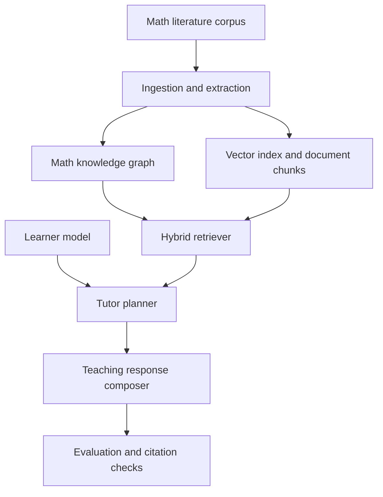

# MathTeach Architektur

## Nordstern

Der Agent soll Mathematik nicht nur loesen, sondern lehren koennen:

- korrekt,
- anschaulich,
- zielgruppengerecht,
- historisch verortet,
- quellengebunden.

Das ist kein einzelner Prompt. Es ist ein System aus Wissen, Retrieval, Didaktik und Evaluation.

## Zielarchitektur

## Kernkomponenten

### 1. Ingestion-Layer

Der Offline-Layer verarbeitet Buecher, Papers, Vorlesungsskripte, historische Texte und moderne Anwendungen.

Er extrahiert strukturiert:

- Konzepte
- Definitionen
- Theoreme
- Gleichungen
- Herkunft und historische Linie
- Beweise oder Beweisideen
- Voraussetzungen
- Anwendungen
- typische Missverstaendnisse

Empfehlung:

- `gemini-2.5-pro` fuer sehr grosse Dokumente und Langkontext-Extraktion
- Batch-Verarbeitung statt Live-Abfragen
- menschliche Review-Gates fuer hochwertige Quellen

### 2. Mathematik-Wissenssystem

Der Kern ist nicht nur ein Vektorindex, sondern ein kombiniertes Wissensmodell:

- Graph fuer Abhaengigkeiten und historische Beziehungen
- Vektorsuche fuer semantische Naehe
- relationale Speicherung fuer saubere APIs, Sessions und Nutzerprofile

Empfohlene Speicher:

- `PostgreSQL` fuer Produktdaten, Sessions, Quellen-Metadaten
- `pgvector` fuer semantische Suche
- optional `Neo4j` oder graph-aehnliche Kanten in Postgres fuer Konzept- und Gleichungslinien
- Objektspeicher fuer Rohdokumente und OCR-Artefakte

### 3. Pedagogical Layer

Der Lehr-Agent braucht getrennte Logik fuer:

- Altersgruppe
- Vorwissen
- Frustrationstoleranz
- Sprachlevel
- gewuenschte Strenge
- bevorzugte Darstellungsform wie Visualisierung, Analogie, Formalismus

Dieser Layer entscheidet nicht, ob Mathematik wahr ist, sondern wie dieselbe Wahrheit praesentiert wird.

### 4. Tutor Runtime

Die Live-Laufzeit sollte in klaren Schritten arbeiten:

1. Lernziel und Profil verstehen
2. Wissensluecken und Voraussetzungen bestimmen
3. passendes Material abrufen
4. Erklaerung im passenden Ton und Detailgrad erzeugen
5. Verstaendnis pruefen
6. bei Bedarf neue Darstellung waehlen

Die Runtime braucht dabei mindestens zwei erkannte Hauptmodi:

- `worked_example_tutoring` fuer konkrete Aufgaben und Zahlenbeispiele
- `origin_story_explanation` fuer Laienfragen, die vom Ursprung, Bedarf und Einsatz einer Idee her erklaert werden sollen

Ein dritter Mischmodus verbindet beides:

- `origin_then_example`

Empfehlung:

- `gpt-5.4` als Haupt-Orchestrator
- `gpt-5.4-mini` fuer schnelle Hilfsaufgaben
- harte Struktur-Outputs fuer Plan, Quellen und naechste Lernschritte

### 5. Evaluation

MathTeach braucht zwei getrennte Eval-Schienen:

- Fachlichkeit: Ist die mathematische Aussage korrekt?
- Didaktik: Ist die Erklaerung fuer diese Zielgruppe wirklich hilfreich?

Pflichtmetriken:

- Quellenabdeckung
- Halluzinationsrate
- Prerequisite-Fehler
- Loesungsrichtigkeit
- Verstaendnisgewinn pro Session
- Nutzerabbruch nach Schwierigkeitsanstieg

## Warum dieses Modellsetup?

Die folgende Entscheidung ist eine Architektur-Inferenz aus aktuellen offiziellen Modellfaehigkeiten:

- `gpt-5.4` ist die beste Default-Wahl fuer komplexe Agentenarbeit, Tool-Nutzung, File Search und Computer Use.
- `gpt-5.4-mini` deckt kostensensitive Echtzeit-Pfade ab.
- `gemini-2.5-pro` ist stark fuer sehr grosse Dokumente, Mathematik, STEM und Langkontext-Ingestion.
- `claude-opus-4-6` eignet sich als Zweitmeinung fuer anspruchsvolle Analyse- und Gegenpruefungsfaelle.

## Produktprinzipien

- Keine Antwort ohne Quellenanker bei anspruchsvollen fachlichen Aussagen
- Erst Voraussetzungen klaeren, dann erklaeren
- Erklaerungstiefe adaptiv statt statisch
- Historische Herkunft und moderne Anwendung zusammen denken
- Unsicherheit offen markieren statt zu improvisieren
