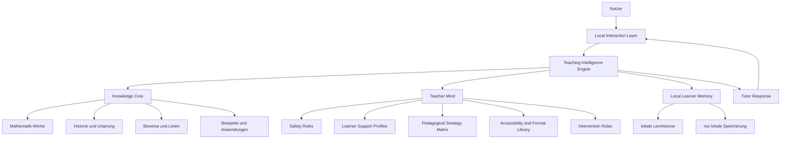

# Closed Local Tutor System Blueprint

## Zielbild

MathTeach soll nicht nur eine App mit Lerninhalten sein.

MathTeach soll ein `geschlossenes lokales Tutorsystem` sein.

Das bedeutet:

- kein Cloud-Zwang
- keine externe Laufzeitabhaengigkeit
- keine Weitergabe sensibler Nutzerdaten
- alle Kernsysteme lokal auf einer Speichereinheit

Die Plattform kann dabei variieren:

- App
- Desktop-System
- Tablet-Loesung
- eigenes Lern-Geraet mit Bildschirm, Mikrofon und Lautsprecher

Die innere Architektur bleibt gleich.

## USP

Der Kernnutzen von MathTeach liegt in drei verbundenen Eigenschaften:

### 1. Maximales Mathematik-Fachwissen

Der mathematische Wissensbestand liegt lokal vor und ist so breit und tief wie technisch und menschlich sinnvoll erreichbar.

Das umfasst:

- historische Werke
- Begriffe
- Gleichungen
- Theoreme
- Beweise
- Ursprungsprobleme
- Anwendungen
- Missverstaendnisse

### 2. Maximale Vermittlungskompetenz

Der Tutor besitzt einen `Teacher Mind`, der in Paedagogik, Zugaenglichkeit und psychologischer Vorsicht staerker ist als ein normaler Einzel-Lehrer es praktisch sein kann.

Er kann:

- unterschiedlich erklaeren
- unterschiedliche Lernvoraussetzungen beruecksichtigen
- Lernbarrieren erkennen
- Erklaerformate wechseln
- geduldig, systematisch und individuell fuehren

### 3. Geschlossenes lokales System

Alles liegt auf dem Geraet oder in der lokalen Installation:

- Fachwissen
- Lehrerwissen
- Nutzerkontext
- Lernverlauf
- Strategieanpassung
- Ein- und Ausgabe

## Systemthese

MathTeach ist kein normaler Chatbot.

MathTeach ist ein lokales System aus:

- `Knowledge Core`
- `Teacher Mind`
- `Teaching Intelligence Engine`
- `Local Interaction Layer`

## Kernarchitektur

## Teaching Intelligence Engine

Das Verbindungsgehirn des Systems ist die `Teaching Intelligence Engine`.

Sie ist kein einzelner magischer Schritt, sondern eine lokale Steuerlogik.

Sie verbindet:

1. Fachwissen aus dem `Knowledge Core`
2. Vermittlungsregeln aus dem `Teacher Mind`
3. selbstbeschriebene Angaben des Nutzers
4. lokale Lernhistorie
5. aktuelle Unterrichtsstrategie

Ihre Aufgaben:

- passende mathematische Inhalte waehlen
- passenden Erklaermodus waehlen
- das richtige Tempo finden
- das richtige Format finden
- auf Verstaendnisprobleme reagieren
- historische Motivation einbauen, wenn sie beim Verstehen hilft

## Lokale Speicherlogik

Die lokale Speicherung ist kein Nebenaspekt, sondern ein Kernprinzip.

Lokal gespeichert werden koennen:

- mathematische Werke
- Quellenregister
- Netzwerk- und Herkunftslinien
- Teacher-Mind-Regeln
- selbstbeschriebene Lernbedarfe
- lokaler Lernverlauf

Nicht vorgesehen ist:

- externe Profilweitergabe
- Cloudpflicht
- Abfluss sensibler Lerninformationen

## App oder Geraet

Die Plattform ist austauschbar.

### App-Variante

Moeglich auf:

- Desktop
- Tablet
- Smartphone

Geeignet fuer:

- persoenliche Nutzung
- Schulen
- Bibliotheken
- Lernzentren

### Geraete-Variante

Moeglich als:

- eigenstaendiges Bildschirmgeraet
- Sprachein- und ausgabefaehiges Lernterminal
- robustes Low-Cost-Lerngeraet

Geeignet fuer:

- Haushalte ohne starke Bildungsunterstuetzung
- Lernumgebungen mit geringer Infrastruktur
- lokale Bildungsprogramme

In beiden Faellen bleibt MathTeach:

- lokal
- geschlossen
- privat
- und in seiner Logik identisch

## Sozialer Zielwert

MathTeach soll nicht nur ein Premium-Werkzeug fuer privilegierte Lernende sein.

Es soll ein System sein, das:

- hochwertige Lernhilfe bezahlbar macht
- individuelle Nachhilfe verallgemeinert
- auch armutsbetroffenen Lernenden echte Unterstuetzung gibt
- Lernende mit Beeintraechtigungen nicht im Standardsystem verliert
- Selbstverwirklichung ueber Wissen und Verstehen ermoeglicht

## Warum dieses System einen echten Unterschied machen kann

Ein normaler Lehrer kann in der Praxis selten gleichzeitig haben:

- extremes Fachwissen ueber die gesamte Geschichte und Tiefe der Mathematik
- unendliche Geduld
- perfekte Anpassung an individuelle Lernbedarfe
- konstante Verfuegbarkeit
- hohe didaktische Spezialisierung ueber viele Unterstuetzungsbedarfe hinweg

MathTeach soll genau an dieser Stelle anders sein:

- fachlich tiefer
- paedagogisch anpassbarer
- psychologisch vorsichtiger
- zugangsoffener
- lokal verfuuegbar

## Produktversprechen

Das Produktversprechen lautet sinngemaess:

- jeder Mensch soll Zugang zu einem aussergewoehnlich starken Mathematik-Tutor bekommen koennen
- nicht nur fuer Eliten, sondern gerade auch fuer Lernende mit weniger Unterstuetzung
- nicht nur fuer Standardlerner, sondern auch fuer Menschen mit besonderen Lernbedarfen

## Naechste Architekturbausteine

Nach diesem Blueprint folgen als saubere Folgeschritte:

1. `Learner Support Profiles`
2. `Pedagogical Strategy Matrix`
3. `Accessibility and Format Library`
4. `Teaching Intelligence Engine policy rules`
5. `lokale Tutor-Session-Architektur`

## Schlussformel

MathTeach ist:

- maximales Mathematik-Fachwissen
- plus maximales Vermittlungswissen
- plus lokale adaptive Steuerung

in einem geschlossenen System.
