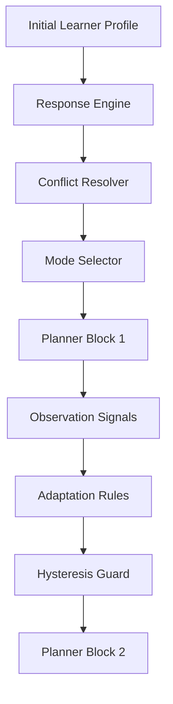

# Live Mode Adaptation Program

## Zweck

Dieses Dokument definiert Phase `H` von MathTeach:

- `planner-level live mode adaptation`

Die Phase baut auf:

- `Support Response Matrix`
- `conflict_resolver`
- `priority_ladders`
- `mode_selector`

auf und fuehrt den naechsten Schritt ein:

- adaptive Moduswechsel waehrend einer laufenden Sitzung

## Zielbild

Der Tutor soll nicht nur zu Beginn einer Sitzung den passenden Modus waehlen,
sondern spaeter auch erkennen:

- ob der aktuelle Modus zu schwer wird
- ob der Lernende schneller vorankommt als erwartet
- ob eine ruhigere oder direktere Erklaerform jetzt wirksamer waere

Wichtig:

- keine hektischen Wechsel
- keine Black-Box-Logik
- keine Anpassung auf jedem Einzelschritt

## Grundprinzip

Phase `H` arbeitet zuerst auf `Block-Ebene`.

Das bedeutet:

- eine Sitzung besteht aus kleinen Lehrbloecken
- Signale werden ueber einen Beobachtungszeitraum gesammelt
- Moduswechsel werden nur an logischen Uebergangspunkten geprueft

## Phase-H-Architektur

## H.1 Observation Signals

Die erste Live-Version braucht nur wenige, klare Signalklassen.

Die operative Ausarbeitung dafuer liegt jetzt in:

- [live-mode-adaptation-specification.md](/Users/jonasweiss/MathTeach/docs/live-mode-adaptation-specification.md)

Die Spezifikation beantwortet jetzt auch explizit:

- was ein `Block` ist
- wann der Wechsel-Check laeuft
- welche Schwellen als `weak`, `meaningful`, `strong` gelten
- wie `runtime_mode_adapter` gegen Phase `G` abgegrenzt ist

### Positive Signals

- `rapid_correct_answers`
- `visible_confidence`
- `pattern_recognition`

### Negative Signals

- `repeated_error_pattern`
- `withdrawal_signal`
- `cognitive_overload`

### Context Signals

- `time_since_last_success`
- `block_number`
- `mode_change_history`

## H.2 Adaptation Questions

Vor jedem moeglichen Wechsel soll der Planner nur drei Fragen beantworten:

1. Ist der aktuelle Modus im letzten Block stabil tragfaehig geblieben?
2. Gibt es ein starkes Signal fuer Ueberforderung oder fuer schnelle
   Selbststaendigkeit?
3. Ist ein Wechsel paedagogisch besser als im Modus zu bleiben?

## H.3 Erste Wechselrichtungen

Die erste Ausbaustufe soll nur wenige, klare Wechsel erlauben.

### Bei Ueberforderung

- `origin_then_example -> worked_example_tutoring`
- `guided_concept_explanation -> worked_example_tutoring`
- `formal_compact_explanation -> guided_concept_explanation`

### Bei stabilen Erfolgen

- `worked_example_tutoring -> guided_concept_explanation`
- `guided_concept_explanation -> origin_then_example`

### Vorlaeufig nicht priorisiert

- direkte Spruenge zwischen sehr entfernten Modi
- mehrere Wechsel innerhalb desselben Blocks

## H.4 Hysteresis And Stability

Live-Adaption braucht fruehe Stabilisatoren.

### Guardrails

- `min_blocks_in_mode`
- `minimum_signal_strength_for_shift`
- `max_mode_changes_per_session`
- `cooldown_after_mode_change`

### Ziel

Der Tutor soll nicht:

- hektisch reagieren
- den Lernenden verwirren
- dauernd zwischen zwei Modi springen

## H.5 Transition Language

Ein Moduswechsel darf nicht technisch wirken.

Beispiele:

- "Lass mich einen Schritt zurueckgehen und es klarer zeigen."
- "Das klappt schon gut. Jetzt gebe ich dir etwas mehr Eigenraum."
- "Wir bleiben bei derselben Idee, aber ich erklaere sie jetzt direkter."

Nicht gewollt:

- technische Systemmeldungen
- Benennung interner Modusnamen gegenueber Lernenden

## H.6 Erste Datenobjekte

Die Phase braucht spaeter voraussichtlich:

- `PlannerObservationSignal`
- `ModeAdaptationDecision`
- `ModeAdaptationState`

Diese sollen tragen:

- aktueller Modus
- zuletzt beobachtete Signale
- begruendeter Wechsel oder Verbleib
- Schutzregeln gegen zu haeufige Anpassung

## H.7 Teststrategie

Die erste Testschicht fuer Phase `H` soll zunaechst simuliert bleiben.

### Kernfaelle

1. Ueberforderung fuehrt zu vereinfachtem Modus
2. stabiler Erfolg fuehrt zu etwas offenem Modus
3. Hysterese verhindert zu fruehen Wechsel
4. Uebergangssprache bleibt ruhig und nicht-technisch

### Ziel

- spaeter `40+` Tests im ersten H-Block
- kein Rueckschritt der bisherigen Planner- und Mode-Selection-Tests

Die operative Testaufschluesselung liegt jetzt ebenfalls in:

- [live-mode-adaptation-specification.md](/Users/jonasweiss/MathTeach/docs/live-mode-adaptation-specification.md)

## H.8 Reihenfolge

1. `observation signal schema`
2. `adaptation rule draft`
3. `hysteresis guard`
4. `transition message templates`
5. `runtime_mode_adapter design`
6. `planner integration`
7. `tests`
8. `journal handoff`

## Nicht-Ziele Von H.1

- noch keine vollstaendige Emotionserkennung
- noch keine Live-Anpassung auf jedem einzelnen Rechenschritt
- noch keine lernhistorische Langzeitanpassung
- noch keine UI fuer manuelle Nutzersteuerung des Modus
- noch keine Pilotierung mit echten Lernenden

## Erwarteter Abschluss von H.1

Phase `H` ist in ihrer ersten Runde erfolgreich, wenn MathTeach:

- den Startmodus weiter sauber waehlt
- nach einem Block begruendet im Modus bleiben oder wechseln kann
- Wechsel erklaerbar und ruhig formuliert
- keine hektischen Rueckwechsel produziert
